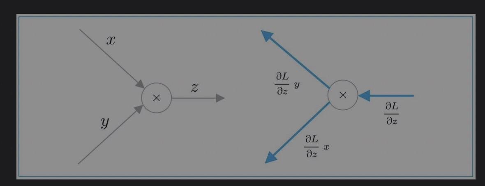

- [数学和python复习](#数学和python复习)
  - [数学](#数学)
  - [神经网络](#神经网络)
    - [简单的分类器](#简单的分类器)
    - [神经网络](#神经网络-1)
    - [推理](#推理)
    - [学习](#学习)
      - [损失函数](#损失函数)
      - [导数和梯度](#导数和梯度)
      - [更新权重](#更新权重)
      - [模型的实现](#模型的实现)
      - [Trainer类](#trainer类)
- [自然语言处理NLP](#自然语言处理nlp)
- [计算的高度化](#计算的高度化)

# 数学和python复习
## 数学
向量是一维数组
矩阵是二维数组
将向量和矩阵扩展到N维的数据集合，就是张量
NumPy、np.ndarray、shape（多维数组的形状）、ndim（维数）
广播
[1, 2         [ 10, 20
 3, 4] * 10 =   30, 40 ]
向量内积: 两个向量对应元素的乘积之和
x * y = x1y1 + x2y2 + ... + xnyn

## 神经网络
神经网络的处理分为**学习**和**推理**两个部分
简单的说，神经网络就是一个函数。函数是将某些输入变换成某些输出的变换器。
### 简单的分类器

y = ax + b

### 神经网络


神经网络在分类上体现为n维，因此能解决更为复杂的分类问题

### 推理
全连接层计算
Affine层
h = xW + b
x: 输入
W: 权重矩阵
b: 偏置
全连接层的变换是线性变换。激活函数赋予它“非线性”的效果，可以增强神经网络的表现力。
sigmoid函数 = 1 / （1 + e^（-x））

输出在0-1区间
```
import numpy as np
def sigmoid(x):
  return 1 / (1 + np.exp(-x))

x = np.random.randn(10, 2) // 10笔样本数据
W1 = np.random.randn(2, 4) // 隐藏层4个神经元
W2 = np.random.randn(4, 3) // 输出层3个神经元
h = np.dot(x, W1)
a = sigmoid(h)
s = np.dot(a, W2)
```


### 学习
不进行神经网络的学习，就做不到“好的推理”。

#### 损失函数


Softmax层输出是概率
yk = e(sk) / sum(e(s1) + e(s2) + ... + e(sn))
Softmax函数的分子是得分sk的指数函数，分母是所有输入信号的指数函数的和，Softmax函数的分子是得分sk的指数函数，分母是所有输入信号的指数函数的和。

交叉熵误差
L(k) = -(tk*logyk)

```
def cross_entropy_error(y, t):
    if y.ndim == 1:
        t = t.reshape(1, t.size)
        y = y.reshape(1, y.size)
        
    if t.size == y.size:
        t = t.argmax(axis=1)
             
    batch_size = y.shape[0]

    return -np.sum(np.log(y[np.arange(batch_size), t] + 1e-7)) / batch_size
```

#### 导数和梯度
1. 仿射层梯度
神经网络的学习的目标是找到损失尽可能小的参数。
乘法节点的反向传播



代码
去掉偏置b的仿射层计算是矩阵乘积MatMul层计算
```
class Affine:
    def __init__(self, W):
        self.params = [W]
        self.grads = [np.zeros_like(W)]
        self.x = None

    def forward(self, x):
        W = self.params
        out = np.dot(x, W)
        self.x = x
        return out

    def backward(self, dout):
        W, b = self.params
        dx = np.dot(dout, W.T)
        dW = np.dot(self.x.T, dout)

        self.grads[0][...] = dW //grads[0][...] = dW的覆盖相当于深复制
        return dx
```
2. sigmoid层梯度
   yk = 1 / (1 + e^(-x))
   grad(yk) = y(1-y) 
代码
```
class Sigmoid:
    def __init__(self):
        self.params, self.grads = [], []
        self.out = None

    def forward(self, x):
        out = 1 / (1 + np.exp(-x))
        self.out = out
        return out

    def backward(self, dout):
        dx = dout * (1.0 - self.out) * self.out
        return dx
```

3. Softmax with Loss层梯度
   
> 从Softmax层传来的反向传播有y1-t1, y2-t2,y3-t3这样一个很“漂亮”的结果。因为y1, y2, y3是Softmax层的输出，t1, t2, t3是监督标签，所以y1-t1, y2-t2, y3-t3是Softmax层的输出和监督标签的差分。神经网络的反向传播将这个差分（误差）传给前面的层。这是神经网络的学习中的一个重要性质。

ps，这里我理解是差分严格意义上不等于求导，但在某种程度上，反应为梯度，这里将softmax和cross entropy error层合并为一层，是为了简化梯度的计算。
```
class SoftmaxWithLoss:
    def __init__(self):
        self.params, self.grads = [], []
        self.loss = None
        self.y = None  # sigmoidの出力
        self.t = None  # 教師データ

    def forward(self, x, t):
        self.t = t
        self.y = 1 / (1 + np.exp(-x))

        self.loss = cross_entropy_error(np.c_[1 - self.y, self.y], self.t)

        return self.loss

    def backward(self, dout=1):
        batch_size = self.t.shape[0]

        dx = (self.y - self.t) * dout / batch_size
        return dx
```
神经网络学习按照如下步骤学习：
1. mini-batch
2. 计算梯度。选择mini-batch数据，根据误差反向传播法获得权重的梯度。这个梯度指向当前的权重参数所处位置中损失增加最多的方向。
3. 更新参数。通过将参数向该梯度的反方向更新，可以降低损失。这就是梯度下降法（gradient descent）。
4. 重复以上过程

#### 更新权重
SGD(随机梯度下降法)，还有其他AdaGrad和Adam等方法。

```
class SGD:
    def __init__(self, lr=0.01):
        self.lr = lr
        
    def update(self, params, grads):
        for i in range(len(params)):
            params[i] -= self.lr * grads[i]
```
#### 模型的实现
在机器学习领域，通常将针对具体问题设计的方法（神经网络、SVM等）称为模型
两层神经网络
```
class TwoLayerNet:
    def __init__(self, input_size, hidden_size, output_size):
        I, H, O = input_size, hidden_size, output_size

        W1 = 0.01 * np.random.randn(I, H)
        b1 = np.zeros(H)
        W2 = 0.01 * np.random.randn(H, O)
        b2 = np.zeros(O)

        self.layers = [
            Affine(W1, b1),
            Sigmoid(),
            Affine(W2, b2)
        ]
        self.loss_layer = SoftmaxWithLoss()

        self.params, self.grads = [], []
        for layer in self.layers:
            self.params += layer.params
            self.grads += layer.grads

    def predict(self, x):
        for layer in self.layers:
            x = layer.forward(x)
        return x

    def forward(self, x, t):
        score = self.predict(x)
        loss = self.loss_layer.forward(score, t)
        return loss

    def backward(self, dout=1):
        dout = self.loss_layer.backward(dout)
        for layer in reversed(self.layers):
            dout = layer.backward(dout)
        return dout
```
学习的代码
ch01/train_custom_loop.py

```
model = TwoLayerNet(input_size=2, hidden_size=hidden_size, output_size=3)
optimizer = SGD(lr=learning_rate)
```

#### Trainer类
每次都写相同的代码太无聊了，因此我们将进行学习的类作为Trainer类提供出来。Trainer类的内部实现和刚才的源代码几乎相同，只是添加了一些新的功能而已，我们在需要的时候再详细说明其用法。
```
class Trainer:
    def __init__(self, model, optimizer):
        self.model = model
        self.optimizer = optimizer
        self.loss_list = []
        self.eval_interval = None
        self.current_epoch = 0

    def fit(self, x, t, max_epoch=10, batch_size=32, max_grad=None, eval_interval=20):
        data_size = len(x)
        max_iters = data_size // batch_size
        self.eval_interval = eval_interval
        model, optimizer = self.model, self.optimizer
        total_loss = 0
        loss_count = 0

        start_time = time.time()
        for epoch in range(max_epoch):
            # 打乱数据
            idx = numpy.random.permutation(numpy.arange(data_size))
            x = x[idx]
            t = t[idx]

            for iters in range(max_iters):
                batch_x = x[iters*batch_size:(iters+1)*batch_size]
                batch_t = t[iters*batch_size:(iters+1)*batch_size]

                # 计算梯度，更新参数
                loss = model.forward(batch_x, batch_t)
                model.backward()
                params, grads = remove_duplicate(model.params, model.grads)  # 共有された重みを1つに集約
                if max_grad is not None:
                    clip_grads(grads, max_grad)
                optimizer.update(params, grads)
                total_loss += loss
                loss_count += 1

                # 定期输出学习过程
                if (eval_interval is not None) and (iters % eval_interval) == 0:
                    avg_loss = total_loss / loss_count
                    elapsed_time = time.time() - start_time
                    print('| epoch %d |  iter %d / %d | time %d[s] | loss %.2f'
                          % (self.current_epoch + 1, iters + 1, max_iters, elapsed_time, avg_loss))
                    self.loss_list.append(float(avg_loss))
                    total_loss, loss_count = 0, 0

            self.current_epoch += 1

    def plot(self, ylim=None):
        x = numpy.arange(len(self.loss_list))
        if ylim is not None:
            plt.ylim(*ylim)
        plt.plot(x, self.loss_list, label='train')
        plt.xlabel('iterations (x' + str(self.eval_interval) + ')')
        plt.ylabel('loss')
        plt.show()
```
```
model = TwoLayerNet(input_size=2, hidden_size=hidden_size, output_size=3)
optimizer = SGD(lr=learning_rate)

trainer = Trainer(model, optimizer)
```

# 自然语言处理NLP
是一种能够让计算机理解人类语言的技术。
* 基于同义词词典的方法
* 基于计数的方法
* 基于推理的方法(word2vec)
  
## 单词的分布式表示
世界上存在各种各样的颜色，有的颜色被赋予了固定的名字，比如钴蓝（cobalt blue）或者锌红（zinc red）；颜色也可以通过RGB（Red/Green/Blue）三原色分别存在多少来表示。前者为不同的颜色赋予不同的名字，有多少种颜色，就需要有多少个不同的名字；后者则将颜色表示为三维向量。
单词本身没有含义，单词含义由它所在的上下文（语境）形成。
单词本身没有含义，单词含义由它所在的上下文（语境）形成。

基于技术的方法的问题：
基于计数的方法在处理大规模语料库时会出现问题。

# 基于推理的方法和神经网络


## 神经网络中单词的处理方法
one-hot向量

# 计算的高度化
