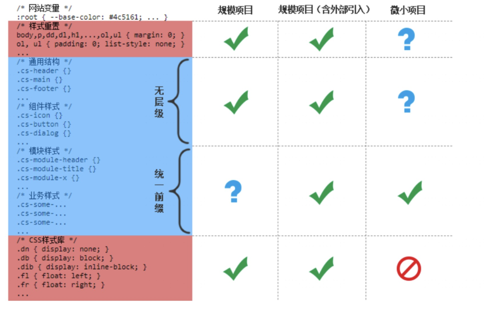

- [概述](#概述)
  - [为什么css选择器很强](#为什么css选择器很强)
  - [基本概念](#基本概念)
    - [css选择器的作用域](#css选择器的作用域)
    - [css选择器的命名空间](#css选择器的命名空间)
  - [无效css选择器的特性与实际应用](#无效css选择器的特性与实际应用)
- [css声明的优先级](#css声明的优先级)
  - [继承和级联](#继承和级联)
    - [继承](#继承)
    - [级联](#级联)
  - [叛逆的!important](#叛逆的important)
  - [css选择器的优先级](#css选择器的优先级)
    - [同等级css优先级规则概览](#同等级css优先级规则概览)
    - [css选择器优先级的计算规则](#css选择器优先级的计算规则)
- [选择器的命名](#选择器的命名)
  - [css选择器是否区分大小写](#css选择器是否区分大小写)
  - [css选择器命名](#css选择器命名)
    - [使用短命名](#使用短命名)
    - [单命名还是组合命名：](#单命名还是组合命名)
    - [面向属性的命名和面向语义的命名](#面向属性的命名和面向语义的命名)
    - [不要嵌套选择器](#不要嵌套选择器)
    - [不要歧视面向属性的命名](#不要歧视面向属性的命名)
    - [正确使用状态类名](#正确使用状态类名)
    - [最佳实践汇总](#最佳实践汇总)
      - [css选择器分布](#css选择器分布)
- [精通css选择符](#精通css选择符)
  - [后代选择符( )](#后代选择符-)
  - [子选择符箭头（\>）](#子选择符箭头)
  - [相邻兄弟选择符加号（+）](#相邻兄弟选择符加号)
  - [随后兄弟选择符（~）](#随后兄弟选择符)
  - [为什么没有前面兄弟选择符](#为什么没有前面兄弟选择符)
- [元素选择器](#元素选择器)
  - [元素选择器的级联语法](#元素选择器的级联语法)
  - [标签选择器二三事](#标签选择器二三事)
- [属性选择器](#属性选择器)
  - [详细了解4种选择器](#详细了解4种选择器)
  - [属性值正则匹配选择器](#属性值正则匹配选择器)
- [用户行为伪类](#用户行为伪类)
  - [手型经过伪类:hover](#手型经过伪类hover)
    - [体验优化与hover延时](#体验优化与hover延时)
    - [纯:hover显示浮层的体验问题](#纯hover显示浮层的体验问题)
  - [激活状态伪类:active](#激活状态伪类active)
    - [按钮的通用:active样式技巧](#按钮的通用active样式技巧)
    - [:focus](#focus)
    - [:focus-within](#focus-within)
    - [:focus-visible](#focus-visible)
- [URL定位伪类](#url定位伪类)
  - [:visited](#visited)
  - [:target与锚点](#target与锚点)
- [输入伪类](#输入伪类)
- [树结构伪类](#树结构伪类)
  - [:root](#root)
  - [:empty](#empty)
  - [子索引伪类](#子索引伪类)
  - [匹配类型的子索引伪类](#匹配类型的子索引伪类)
- [逻辑组合伪类](#逻辑组合伪类)

# 概述
## 为什么css选择器很强

传统编程语言——逻辑性强——功能服务
css————样式服务

## 基本概念

- 选择器——标签选择器、类选择器
- 选择符——后代关系的空格；父子关系的箭头>、相邻兄弟关系的加号+、兄弟关系的波浪线～、列关系的双管道||
- 伪类——伪类的特征是其前面有一个冒号（:），通常与浏览器行为和用户行为相关联。如a:hover
- 伪元素——伪元素的特征是其前面有两个冒号(::)，常见的有::before、::after、::first-letter和::first-line等。

### css选择器的作用域
伪类:scope的设计初衷就是匹配局部作用域内的元素，目前浏览器不支持。
### css选择器的命名空间
命名空间可以让来自多个xml词汇表的元素的属性或样式不产生冲突
```html
<html xmlns="http://www.w3.org/1999/xhtml">
```
```html
<svg xmlns="http://www.w3.org/2000/svg">
```
上述代码中xmlns指向的地址是一个简单的命名空间，不指向实际的在线地址，浏览器不会处理该地址。
```css
@namespace url(http://www.w3.org/1999/xhtml);
@namespace svg url(http://www.w3.org/2000/svg);
/* XHTML中的<a>元素 */
a {}
/* SVG中的<a>元素 */
svg|a {}
/* 同时匹配XHTML和SVG的<a>元素 */
*|a {}
```
svg|a中有一个管道符|，管道符前面的字母表示命名空间的代称，管道符后面的内容则是选择器。

css选择器命名空间兼容性很好，实用性不强，了解即可。

## 无效css选择器的特性与实际应用
当无效的css选择器和浏览器支持的css选择器在代码中一起出现的时候，会导致整个选择器无效。
```css
.example:hover,
.example:active,
.example:focus-within {
  color: red
}
```
由于IE浏览器不支持:focus-within伪类，导致IE浏览器无法识别整个语句。

**因此，我们在使用一些新的css选择器时，出于渐进增强的目的，需要将它们分开写：**
```
.example:hover,
.example:active {
  color: red
}
.example:focus-within {
  color: red
}
```
不过，在诸多css选择器中，这种无效选择器特性出现一个例外，那就是浏览器可以识别以-webkit-私有前缀开头的伪元素。
除了IE浏览器，其他浏览器均支持识别这个-webkit-无效伪元素的特性。
```css
// 区分IE和其他浏览器
.example {
  background: black
}
.example, ::-webkit-whatever {
  background: black
}
```
# css声明的优先级
## 继承和级联
css优先级规则分为两大类，一类称为继承，另一类称为级联
### 继承
**被继承的css声明的优先级一定位于整个css世界的底层。**
```html
<p id="text">文字</p>
p::first-line { color: blue; }
#text { color: green !important; }
```
请问：文字颜色是blue还是green？
答案是blue！
color属性是一个可继承属性，无论<p>元素的color属性如何设置，对于:first-line伪元素而言，其都是继承属性，优先级最低，因此，最终颜色是blue。
### 级联
级联层的优先级定义为以下10项。

1. transition过渡声明；
2. 设置了!important的浏览器内置样式；
3. 设置了!important的用户设置的样式；
4. @layer规则中设置的包含!important的样式；
5. 开发者设置的包含!important的样式；
6. animation动画声明；
7. 开发者设置的css样式；
8. @layer规则中的css样式；
9. 用户设置的css样式；
10. 浏览器内置的css样式；

主要关注下面四个级联层：
- 浏览器内置样式：也称为“用户代理样式”，user agent stylesheet。
- 用户设置样式：用户通过某些行为带来的样式，例如浏览器设置，或者安装的浏览器插件。
- @layer: 用来降低css代码级联层级，从而保证主业务的css代码不受第三方组件的css代码的影响。
  ```css
  @layer {
    .container .some-button {
      height: 30px;
    }
    :any-link {
      color: darkblue;
    }
    :any-link:hover {
      color: blue;
    }
  }

  .some-button {
    height: 40px;
  }
  a { color: deepskyblue; }
  ```
  > 可以看出，虽然业务代码中的按钮选择器只有一个类名.some-button，其优先级低于.container和.some-button这两个类名，但是由于代码所在的级联层更高，因此，还是重置了30px。
- 开发者设置样式：开发人员日常css代码，无论是内联在html中的css还是css文件中的代码，都属于该级联层。

因此比较两段css代码优先级，先比较级联层的优先级，再比较选择器的优先级。

## 叛逆的!important
把上面的级联层级搬下来。
2. 设置了!important的浏览器内置样式；
3. 设置了!important的用户设置的样式；
4. @layer规则中设置的包含!important的样式；
5. 开发者设置的包含!important的样式；
7. 开发者设置的css样式；
8. @layer规则中的css样式；
9. 用户设置的css样式；
10. 浏览器内置的css样式；
可以看到，无论是浏览器内置的css样式、用户设置的css样式、@layer规则中的css样式，还是开发者设置的css样式，其中的css属性只要被设置了!important，就会拥有一个只属于其自身的级联层级。并且!important的级联层级的提升规则是逆向越级。所谓逆向越级，指的是原本级联层级高的css使用了!important之后，优先级反而低；而原本低级联层级css声明在应用了!important之后，css的优先级反而最高。

> 由于!important可以轻松使CSS属性的优先级越级，因此，非到万不得已不要使用这个特性，因为这样会大大增加CSS代码的优先级复杂度，从而增加不必要的维护成本。

## css选择器的优先级
### 同等级css优先级规则概览
每一个级联层中的css优先级也有明显的不可跨越的等级，有0-4共5个等级。其中前四个由css选择器决定，最后一个等级由书写形式决定。
0级： 通配选择器（*）、选择符（空格、>、+、～和||）和逻辑组合伪类（:not()、:is()、:where()）。只有逻辑组合伪类的优先级是0级，其他伪类的优先级并非如此。
1级：标签选择器
2级：类选择器、属性选择器、伪类
3级：ID选择器
4级：style属性内联
### css选择器优先级的计算规则
| 选择器 | 优先级数值 | 计算规则 |
| ----  | ---- | ---- |
| *{} | 0 | 1个0级通配选择器，优先级数值为0 ｜
| dialog {} | 1 | 1个1级标签选择器，优先级数值为1 |
| ul > li {} | 2 | 2个1级标签选择器，优先级数值为1+0+1 ｜
| li > ol + ol{} | 3 | 3个1级标签选择器，2个0级选择符，优先级数值为1+0+1+0+1 |
| .foo {} | 10 | 1个2级类选择器，优先级数值为10 |
| a:not([rel=nofollow]){} | 11 | 1个1级标签选择器，1个0级否定伪类，1个2级属性选择器，优先级数值为1+0+10 |
| a:hover{} | 11 | 1个1级标签选择器，1个2级伪类，优先级数值为1+10 ｜
| ol li.foo {} | 12 | 1个2级类选择器，2个1级标签选择器，1个0级空格选择符，优先级数值为1+0+1+10 |
| li.foo.bar {} | 21 | 2个2级类选择器，1个1级标签选择器，优先级数值为10*2+1 |
| #foo {} | 100 | 1个3级ID选择器，优先级数值为100 |
| #foo .bar p{} | 111 | 1个3级ID选择器，1个2级类选择器，1个1级标签选择器，优先级数值为100+10+1 |
当两个选择器的优先级数值相等，遵从后来居上原则。
css选择器的优先级与DOM元素的层级位置没有任何关系。例如：
```css
body .foo { color: red; }
html .foo { color: blue; }
```
答案是蓝色。虽然body离.foo的距离更近，但决定选择器的优先级时不考虑DOM的位置。

# 选择器的命名
## css选择器是否区分大小写
在HTML中，标签和属性都不区分大小写，而属性值区分大小写。
相应的，在css中，标签选择器不区分大小写，属性选择器中的属性也不区分大小写，类选择器和ID选择器本质上是属性值，因此要区分大小写。
目前各大浏览器支持属性选择器中的属性值也不区分大小写（在]前面加一个i）
```css
[class~="val" i] {}
```
## css选择器命名
### 使用短命名
### 单命名还是组合命名：
  | 场景 | 优选 |
  | 多人合作，长期维护 | 组合命名 |
  | 使用第三方库 | 组合命名 |
  | 100%自主研发 | 对于网站公用结构、颜色相关使用单命名；非公用内容，如标题、盒子使用组合命名 |
  | 网页日后被复用 | 组合命名 |
  | 基于css属性构建 | 单命名。 例如：.db { display: block; } |

### 面向属性的命名和面向语义的命名
面向属性的命名指选择器的命名是跟着具体的css样式走的。
```css
.clear:after {
  content: '';
  display: table;
  clear: both;
}
.dn {
  display: none;
}
.db {
  display: block;
}
.df {
  display: flex;
}
.dg {
  display: grid;
}
.fl {
  float: left;
}
.tl {
  text-align: left;
}
.tr {
  text-align: right;
}
.tc {
  text-align: center;
}
.tj {
  text-align: justify;
}
```
面向属性的命名
优点：重用率高，即插即用。
缺点：属性单一，使用场景有限。
面向语义的命名
优点：灵活丰富，应用场景广泛。
缺点：代码笨拙，效率一般。
### 不要嵌套选择器
1. 渲染性能糟糕
有两方面会对渲染性能造成影响，一是标签选择器，二是过深的嵌套。
css的选择器的性能排序如下：
* ID选择器
* 类选择器
* 标签选择器
* 通配符选择器
* 属性选择器
* 部分伪类
  
.box > div
css选择器是从右往左进行匹配渲染，.box > div是先匹配页面所有的div元素，再匹配.box类名元素。

2. 优先级混乱
3. 样式布局脆弱，调整html标签，样式坏掉
4. 正确的选择器用法。全部使用无嵌套的纯类名选择器

### 不要歧视面向属性的命名
主要用来处理一些细枝末节
### 正确使用状态类名

### 最佳实践汇总
* 不要使用ID选择器
* 无标签，无层级
* 状态类名标识符
* 面向属性命名的css样式库
* 正确使用状态类名。.disabled,.checked,.active。**状态类名自身绝对不能有css样式！**
* 无嵌套、无级联的类选择器+属性命名的样式库

#### css选择器分布


# 精通css选择符
## 后代选择符( )
当包含后代选择符的时候，整个选择器的优先级与祖先元素的DOM层级没有任何关系，这时要看落地元素的优先级。
```html
<div class="lightblue">
  <div class="darkblue">
    <p>1. 颜色是？</p>
  </div>
</div>
<div class="darkblue">
  <div class="lightblue">
    <p>1. 颜色是？</p>
  </div>
</div>
.lightblue p {color: lightblue;}
.darkblue p {color: darkblue;}
```
答案是：darkblue
落地元素p的DOM层级一样，选择器优先级的计算值一样，遵循后来居上原则。

## 子选择符箭头（>）
子选择符和后代选择符的区别是：子选择符只会匹配第一代子元素、后代选择符会匹配所有子元素。
能不用子选择符就尽量不用，因为一旦使用了子选择符，元素的层级关系就被强制绑定了。使用子选择符的主要目的是避免冲突。
使用场景：
1. 状态类名控制
2. 标签受限

## 相邻兄弟选择符加号（+）
相邻兄弟选择符选择相邻的兄弟元素，但只能选择后面一个兄弟。
会忽视文本节点和注释节点
实现类似:first-child的功能

## 随后兄弟选择符（~）
相邻兄弟选择符只会匹配它后面的第一个兄弟元素，而随后兄弟选择符会匹配后面的所有兄弟元素。

## 为什么没有前面兄弟选择符
缺少前面兄弟选择符和父选择符的支持，是因为DOM的渲染规则是从前往后，由外及里。
如何实现前面兄弟选择符的效果，把“前面的元素”的相关代码放在后面。

# 元素选择器
## 元素选择器的级联语法
1. 元素选择器是唯一不能重复自身的选择器。无法像其他选择器那样通过重复自身提高优先级。
2. 必须写在最前面。

## 标签选择器二三事

1. 标签选择器与属性选择器混合使用时，有些属性可以省略标签选择器。性能也有提升。
   ```css
   [type="radio"] {}
   ```
2. 特殊的标签选择器：通配选择器。指代所有类型的标签元素，包括自定义元素、<script>、<style>、<title>，但不包括伪元素。

```css
*, *::before, *::after {box-sizing: border-box;}
```
由于通配选择器（*）匹配所有元素，因此它是比较消耗性能的一种css选择器。

# 属性选择器
我们平常提到的属性选择器指的是[type="radio"]这类选择器，实际上，这是一种简称，指的是“属性值匹配选择器”。实际上，在正式文档中，类选择器和ID选择器都属于属性选择器。
## 详细了解4种选择器
1. [attr]。[attr]表示只要包含指定的属性就匹配。
2. [attr="val"]是属性值完全匹配选择器。
其他注意事项：不区分单双引号，引号省略也是合法的。如果属性包含空格，需要转义或老老实实用引号。
3. [attr~="val"]是属性值单词完全匹配选择器，用来匹配属性中的单词（用空格分隔的多属性值）。匹配的属性值不能是空字符串，空字符串不会匹配任何元素。
4. [attr|="val"]是属性值起始片段完全匹配器，表示具有attr属性的元素，其值要么正好是val，要么以val外加短横线-开头。该选择器设计的初衷是子语言匹配。

## 属性值正则匹配选择器
```css
[attr^="val"] // 前匹配
[attr$="val"] // 后匹配
[attr*="val"] // 任意匹配
[attr*="val" i] // 忽略大小写
```

# 用户行为伪类
## 手型经过伪类:hover
在桌面端用的很多，在移动端不用
### 体验优化与hover延时
css :hover的触发是即时的，于是，当用户不经意在页面划过时，会出现浮层覆盖目标元素的情况。可以通过增加延时来优化这种体验，方法就是使用visibility属性实现元素的显隐，然后借助css transition设置延迟即可。
```css
.icon-delete::before,
.icon-delete::after {
  transition: visibility 0s .2s;
  visibility: hidden;
}
.icon-delete:hover:before,
.icon-delete:hover:after {
  visibility: visible;
}
```
### 纯:hover显示浮层的体验问题
纯:hover显示浮层的体验问题是很多开发人员没有意识到的。
:hover交互在有鼠标的时候很方便，但是如果用户的鼠标坏了，或者设备本身没有鼠标（如触屏设备，智能电视）等，则纯:hover实现的功能就完全瘫痪了。
对于代交互的行为，一定不能只用:hover伪类，还需要使用其他的处理。
## 激活状态伪类:active
- IE浏览器下:active样式是无法冒泡的
- 移动端safari浏览器，:active伪类默认是无效的。

:active伪类的主要作用是反馈点击交互，让用户知道他的点击行为已成功触发。

### 按钮的通用:active样式技巧
本技巧更适用的场景是移动端开发。
```css
body {
  -webkit-tap-highlight-color: rgba(0,0,0,0);
}
[href]:active,
button:active,
[type=reset]:active,
[type=button]:active,
[type=submit]:active {
  background-image: linear-gradient(rgba(0,0,0,.05),rgba(0,0,0,.05));
}
[href] img:active {
  outline: 999px solid rgba(0,0,0,.05);
  outline-offset: -999px;
  -webkit-clip-path: polygon(0 0, 100% 0, 100% 100%, 0 100%);
  clip-path: polygon(0 0, 100% 0, 100% 100%, 0 100%);
}
```
### :focus
- :focus伪类只能匹配特定元素
- 设置了tabindex属性的普通元素也可以应用:focus伪类。
- 使用:hover伪类时候，需要同时设置:focus伪类以提高可访问性。
  
>> ps: 隐藏元素除了display:none, visiblility:hidden，还可以是裁剪，透明度。前者在隐藏的时候，会让元素无法聚焦。

### :focus-within
:focus伪类只有在当前元素处于聚焦状态的时候才匹配，:focus-within伪类在当前元素或者是当前元素的任意子元素处于聚焦状态的时候都会匹配。
对于下拉交互，采用:focus-within伪类实现会是约定俗成的标准解决方案。

### :focus-visible

# URL定位伪类

## :visited
:visited伪类选择器中的色值只能重置，不能凭空设置。
```css
a {
  color: blue;
  background-color: white; // 必须这里设置，:visited伪类才能重置
}
a:visited {
  color: red;
  background-color: gray;
}
```
## :target与锚点
url锚点可以和页面中id匹配的元素进行锚定，浏览器的默认行为是触发滚动定位，同时进行:target伪类匹配。

# 输入伪类

input+label实现自定义效果的单选，复选框

开关效果
```html
<input type="checkbox" id="switch">
<label class="cs-switch" for="switch"></label>
```
```
[type="checkbox"] {
  width: 44px;
  height: 26px;
  position: absolute;
  opacity: 0;
  margin: 0;
  cursor: pointer;
}
.cs-switch {}
:active:not(:disabled) + .cs-switch {}
:checked + .cs-switch {}
:focus-visible + .cs-switch {}
:disabled + .cs-switch {}
```
# 树结构伪类

## :root
通常用来定义变量

## :empty
- 隐藏空元素
- 字段缺失智能提醒
  ```
  td:empty::before {
    content: '-';
    color: gray;
  }
  ```
## 子索引伪类
:first-child和:last-child
:first-child匹配第一个子元素，:last-child匹配最后一个子元素
:only-child匹配没有任何兄弟元素的元素，会忽略匿名文本。
:nth-child()只适用于内容动态、无法确定的匹配场景。
  - 斑马线条纹。
    - tr:nth-child(even)
  - 列表边缘对齐
  - 固定区间的列表高亮
  - 动态列表数量匹配技术

## 匹配类型的子索引伪类
:first-of-type匹配类型的子索引伪类是在同级列表中**相同标签元素**之间进行索引和解析。表示当前标签类型元素的第一个。
```html
dl > :first-of-type {
  color: deepskyblue;
  font-style: italic;
}
<dl>
  <dt>标题</dt>
  <dd>内容</dd>
</dl>
```
<dt>和<dd>均匹配了:first-of-type伪类。

:only-of-type匹配唯一的标签类型的元素。慎用！

# 逻辑组合伪类
:not
**告别重置。**
使用:not()伪类的优点，保护了原类名的优先级，扩展性更强
:is
:is()伪类的作用就是简化选择器。
```css
.cs-avatar-a > img,
.cs-avatar-b > img,
.cs-avatar-c > img,
.cs-avatar-d > img {
  display: block;
  width: 100%;
  height: 100%;
  border-radius: 50%;
}
```
此时可以用is()伪类进行简化：
```css
:is(.cs-avatar-a, .cs-avatar-b, .cs-avatar-c, .cs-avatar-d) > img {}
```
任意匹配伪类:where()
:where()伪类和:is()伪类的含义，语法，作用一模一样。唯一的区别是优先级不一样，:where()伪类的优先级永远是0。


