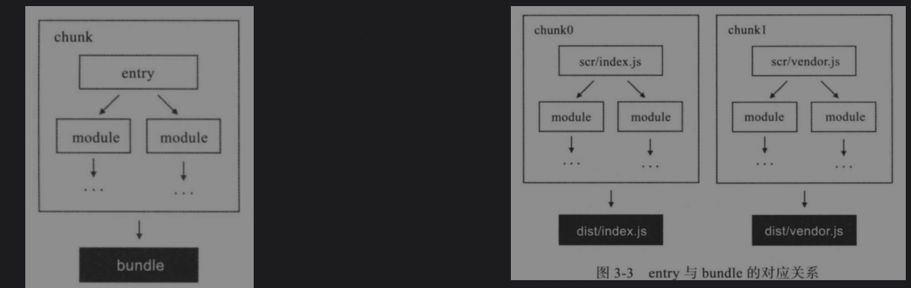
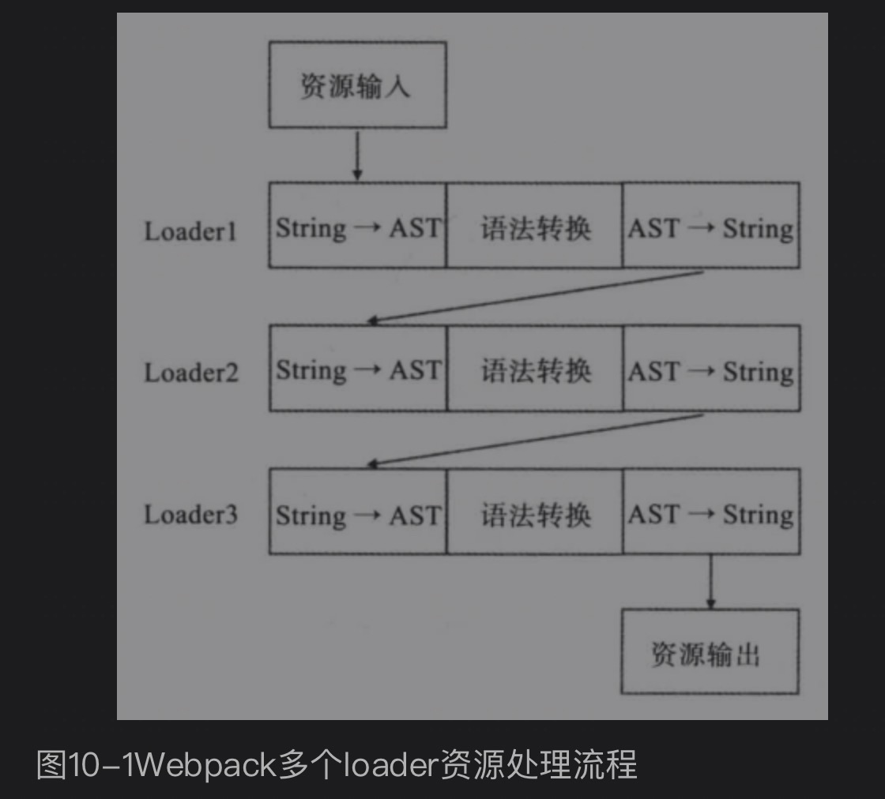
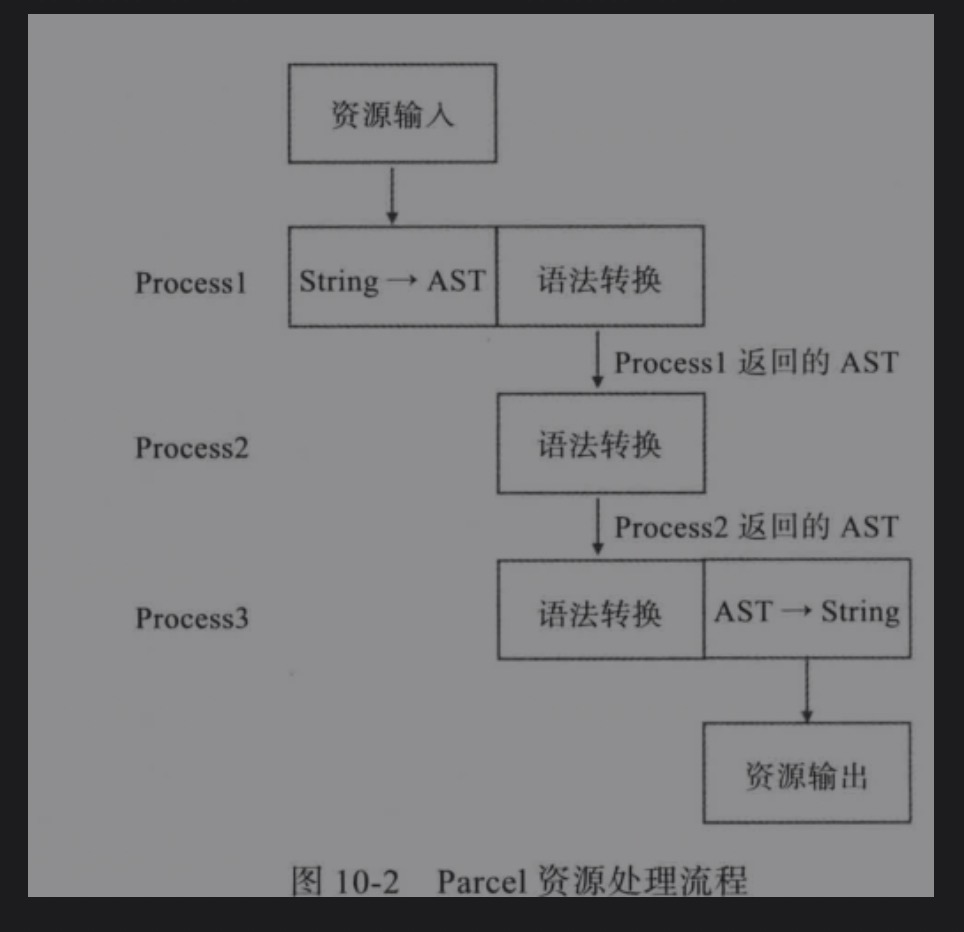
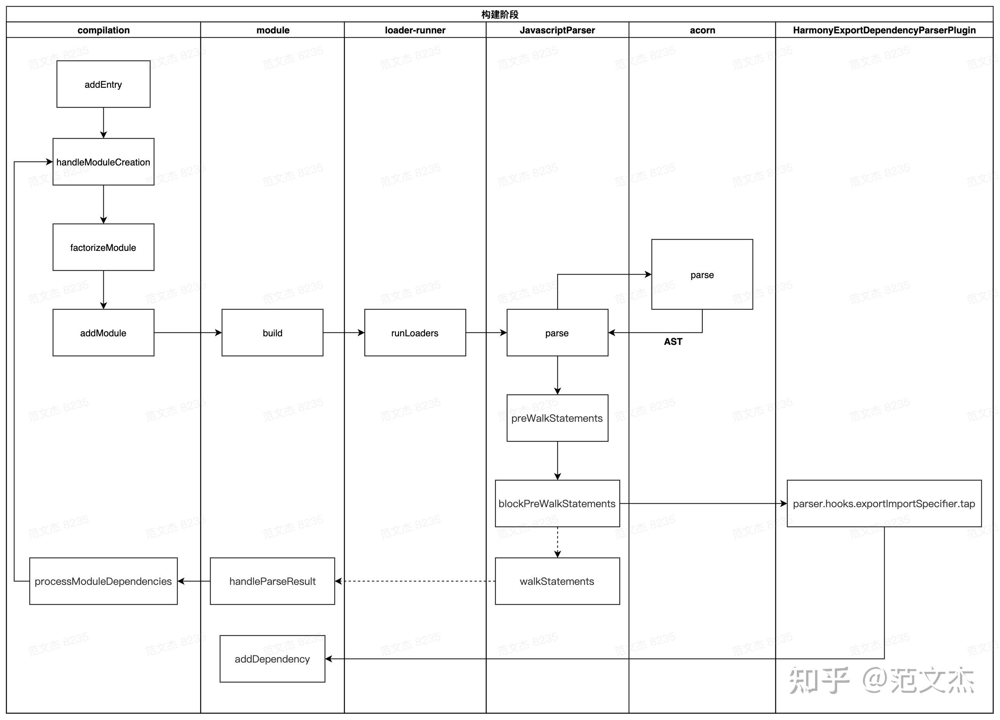

# Webpack
Webpack会从入口文件开始检索，并将具有依赖关系的模块生成一棵依赖树，最终得到一个chunk。有这个chunk得到的打包产物称为bundle


## 模块标准
commonjs与es6module的区别
- 最本质的区别是对模块依赖的解决是“动态”还是“静态”。commonjs是“动态”，其含义是，模块依赖关系的建立发生在代码运行阶段（require的模块路径可以动态指定）；而“静态”则是模块依赖关系的建立发生在代码编译阶段（ES6 module的导入导出语句都是声明式的，不支持导入的路径是一个表达式，并且导入、导出语句必须位于模块的顶层作用域）。
- 值拷贝与动态映射。对于commonjs来说获取的是一份值拷贝，而在es6 module中则是值的动态映射，并且这个映射是只读的，。
- 循环依赖。commonjs中的循环依赖，没法得到预期的结果。es6 module的动态映射特性可以解决支持循环依赖（需要开发保证导入的值被使用时已经设置好正确的值）

AMD异步模块定义，由javascript社区提出的专注于支持浏览器端模块化的标准。

UMD通用模块标准，是一组模块形式的集合。
(function (global, main) {
	If (typeof define .-= ‘function’ && define.amd) {
		// AMD
		define(…)
	} else if (typeof exports === ‘object’) {
		// Commonjs
		module.exports = …
	} else {
		// 非模块环境
		global.add = …
	}
})(this, function() {
 	// 定义模块主体
})

核心的数据结构：Dependency、Module、Chunk

## bundle如何在浏览器中执行。
1）在最外层的匿名函数中会初始化浏览器执行环境，包括定义installModules对象、__webpack_require__函数等，为模块的加载和执行做一些准备工作。
2）加载入口模块。每个bundle都有且只有一个入口模块。
3）执行模块代码。如果执行到了module.exports则记录下模块的导出值；如果中间遇到require函数（准确地说是__webpack_require__），则会暂时交出执行权，进入__webpack_require__函数体内进行加载其他模块的逻辑。
4）在__webpack_require__中会判断即将加载的模块是否存在于installModules中。如果存在则直接取值，否则回到第3步，执行该模块的代码来获取导出值。
5) 所有依赖的模块都已执行完毕，最后执行权又回到入口模块。当入口模块的代码执行到结尾，也就意味着整个bundle运行结束。

## loader
每个loader本质上都是一个函数。**webpack4之前，函数的输入和输出都必须为字符串；在webpack4之后，loader也同时支持AST的传递，通过这种方法减少重复的代码解析。用公式表达loader的本质为以下形式：
```js
output = loader(input)
// loader可以是链式的
output = loaderA(loaderB(loaderC(input)))
```
exclude与include
exclude的含义是，所有被正则匹配到的模块都排除在该规则之外。
include代表该规则只对正则匹配到的模块生效。
exclude和include同时存在时，exclude的优先级更高。

resource和issuer可用于更加精确地确定模块规则的作用范围。
resource: 被加载模块
issuer: 加载者
如果想要对issuer加载者也增加条件限制，则要额外写一些配置。
```js
// 例如只希望/src/pages/目录下面的js文件引用css文件，这条规则才生效。
rules: [{
      test: /.css$/,
      use: ['style-loader', 'css-loader'],
      exclude: /node_modules/,
      issuer: {
            test: /\.js$/,
            include: /src/pages/,
      },
}]
// 可读性更好的配置。通过添加resource对象将外层配置包起来，区分resource和issuer中的规则，就一目了然。
rules: [
      {
            use: ['style-loader', 'css-loader'],
            resource: {
                  test: /\.css$/,
                  exclude: /node_modules/,
            },
            issuer: {
                  test: /\.js$/,
                  exclude: /node_modules/,
            }
      }
]
```
## 常用loader
1. babel-loader：用来处理ES6+并将其编译为ES5。
```
npm install babel-loader @babel/core @babel/preset-env
```
各模块的作用：
- babel-loader: 它是使babel与webpack协同工作的模块。
- babel/core: 顾名思义，它是babel编译器的核心模块。
- babel/preset-env: 它是babel官方推荐的预置器，可根据用户设置的目标环境自动添加所需的插件和补丁来编译ES6+代码。

注意：
1. 由于babel-loader通常属于对所有js后缀文件设置的规则，所以需要在exclude中添加node_modules，否则会令babel-loader编译其中所有的模块，严重拖慢打包速度，并且有可能改变第三方模块的原有行为。
2. 对于babel-loader本身我们添加了cacheDirectory配置项，它会启用缓存机制。
3. **由于@babel/preset-env会将ES6Module转为CommonJS的形式，这会导致webpack中的tree-shaking特性失效，将@babel/preset-env的modules配置项设置为false会禁用模块语句的转化，而将ES6Module的语法交给webpack本身处理**

2. ts-loader
ts-loader与babel-loader的性质类似，它是用于连接webpack和Typescript的模块。
```
npm install ts-loader typescript
```
需要注意的是，typescript本身的配置并不在ts-loader中，而是必须要放在工程目录下的tsconfig.json中。

3. file-loader
file-loader用于打包文件类型的资源，并返回其publicPath。

4. url-loader
url-loader与file-loader类似，唯一的不同在于用户可以设置一个文件大小的阈值，当大于该阈值时与file-loader一样返回publicPath，而小于该阈值时则返回文件base64形式编码。

5. vue-loader
vue-loader用于处理vue组件。vue-loader可以将组件的模版、js及样式进行拆分。除了必要的vue与vue-loader以外，还要安装vue-template-compiler来编译vue模板，以及css-loader来处理样式（如果使用scss或less则仍需要对应的loader）。


loader本质上是一个函数。第一个loader的输入是源文件，之后所有loader的输入是上一个loader的输出，最后一个loader则直接输出给webpack。

```js
module.exports = function(content) {
      return fn(content)
}
```

## 样式处理

1. 分离样式文件
webpack4以前使用extract-text-webpack-plugin。
webpack4及以上使用mini-css-extract-plugin。mini-css-extract-plugin支持按需加载css。extract-text-webpack-plugin最终只能通过html的link标签被同步加载。但mini-css-extract-plugin会单独打包出一个0.css(假设使用默认配置)，这个css文件将由a.js通过动态插入link标签的方式加载。

2. 样式预处理

sass-loader就是将scss语法编译为css，因此在使用时通常还要搭配css-loader和style-loader。除了安装sass-loader之外，还要安装node-sass，node-sass是真正用来编译scss的。
```bash
npm install less-loader less
```
less同样是对css的一种扩展。

postcss不算是一个css的预编译器，它只是一个编译插件的容器。它的工作模式是接受样式源代码并交由**编译插件**处理，最后输出css。
postcss插件:
- autoprefixer是一个样式工具，可以根据caniuse.com上的数据，自动决定是否要为某一特性添加厂商前缀，并且可以由开发者为其指定支持浏览器的范围。
- stylelint: 是一个css的质量检测工具，就像eslint一样，我们可以为其添加各种规则，来统一项目的代码风格，确保代码质量。
- cssnext: postcss可以与cssnext结合使用，使应用能够使用最新的css语法特性。
- css modules: css模块化，让css拥有模块的特点，避免样式冲突。使用cssmodules不需要额外安装模块，只要开启css-loader中的modules配置项即可。

## 性能
1. 代码分片
「CommonsChunkPlugin」
减小整体资源体积；合理有效地利用客户端缓存
CommonsChunkPlugin是webpack4之前内部自带的插件，它可以将多个chunk中公共的部分提取出来。
- 通过入口划分代码：手动维护不常变动的库和工具，将它们放在一个单独的入口，**有效地利用客户端缓存**。适合那些将接口绑定在全局对象上的库。

「optimization.SplitChunks」
splitChunks是webpack4为了改进commonsChunk-plugin而重新设计和实现的代码分片特性。功能比commonschunkplugin功能更加强大，还更简单易用。


```js
optimization: {
      splitChunks: {
            chunks: 'all'
      }
}
```
chunks值为all，这个配置项的意义是，splitChunks将会对所有的chunks生效（默认情况下，splitChunks只对异步chunks生效，并且不需要配置）
splitChunks提取条件：
- 被共享或者来自node_modules目录。
- 提取后的js chunk体积大于30kb(压缩和gzip之前)，cssChunk体积大于50kb。
- 按需加载过程中，并行请求的资源最大值小于等于5.
- 首次加载时，并行请求的资源数量小于等于3.

splitChunks配置
- 匹配模式：async(默认)、initial和all。async只提取异步chunk，initial则只对入口chunk生效。all则是两种模式都开启。

首屏加载的js资源源地址是通过页面中的script标签来指定，而间接资源（通过首屏js再进一步加载的js）的位置则要通过output.publicPath来指定。

## 生产环境
- 环境变量的使用
- 资源压缩
- 优化hash和缓存；动态html

1. webpack-merge
配置合并工具，优化配置
2. mode: production。自动添加许多适用于生产环境的配置项。（DefinePlugin传入process.env.NODE_ENV的值，terserPlugin...）
3. sourcemap。启用了devtool配置项，sourcemap就会跟随源代码一步步被传递，直到生成最后的map文件。这个文件默认是打包后的文件名加上.map后缀。
在生成mapping文件的同时，bundle文件中会追加上一句注释标识map文件的位置。如：
```js
//bundle.js
(function() {
      // bundle的内容
})()
//# sourceMappingURL = bundle.js.map
```
sourcemap的配置
js的sourcemap的配置：
```js
module.exports = {
      // ...
      devtool: 'source-map',
}
```
style的配置，需要额外添加sourcemap的配置项。如下面示例：
```js
module: {
      rules: [
            {
                  test: /\.scss$/,
                  use: [
                        'style-loader',
                        {
                              loader: 'css-loader',
                              options: {
                                    sourceMap: true,
                              }
                        },
                        {
                              loader: 'sass-loader',
                              options: {
                                    sourceMap: true
                              }
                        }
                  ]
            }
      ]
}
```
开发环境，cheap-module-eval-source-map通常是一个不错的选择，属于打包速度和源码信息还原程度的一个良好折中。

生产环境，由于需要使用uglify plugin对代码进行压缩，目前只支持完全的source-map，只能使用source-map、hidden-source-map、nosources-source-map这3者之一。
- source map不仅可以帮助开发者调试源码，当线上有问题产生时有助于查看调用栈信息，是线上查错十分重要的线索。
- hidden-source-map意味着webpack仍然会产出完整的map文件，只不过不会在bundle文件中添加对map文件的引用。需要将map文件上传到第三方服务来追溯源码。
- nosources-source-map

4. 资源压缩
代码压缩，uglify，移除多余的空格、换行及执行不到的代码，缩短变量名。减小体积，代码不可读提高代码的安全性。

5. 压缩
js压缩
uglify + terser

```js
optimization: {
      minimizer: [
            new TerserPlugin({
                  /* 配置 */
            })
      ]
}
```
css压缩
使用extract-text-webpack-plugin或mini-css-extract-plugin将样式提取出来，使用optimize-css-assets-webpack-plugin来进行压缩，这个插件本质上使用的是压缩器cssnano
```js
minimizer: [new OptimizeCSSAssetsPlugin({
      cssProcessor: require('cssnano'),
      cssProcessorOptions: {
            discardComments: {
                  removeAll: true
            }
      }
})]
```
6. 缓存
资源hash
```js
module.exports = {
      entry: './app.js',
      output: {
            filename: 'bundle@[chunkhash].js'
      },
      mode: 'production'
}
```
输出动态html
```js
const HtmlWebpackPlugin = require('html-webpack-plugin');
module.exports = {
      //...
      plugins: [
            new HtmlWebpackPlugin()
      ]
}
```
7. bundle体积分析
webpack-bundle-analyzer

## 打包优化
1. 开启多线程
happypack
代码转移的工作流程：
1）从配置中获取打包入口；
2）匹配loader规则，并对入口模块进行转译；
3）对转译后的模块进行依赖查找（如a.js中加载了b.js和c.js）；
4）对新找到的模块重复进行步骤2和3，直到没有新的依赖模块。

happypack的核心特性是可以开启多个线程，并行地对不同模块进行转译，这样就充分利用本地的计算资源来提升打包速度。适用于转译任务比较重的工程，比如babel-loader和ts-loader。
```js
module.exports = {
      module: {
            rules: [{
                  test: /\.js$/,
                  exclude: /node_modules/,
                  loader: 'happypack/loader'
            }],
      }
      plugins: [
            new HappyPack({
                  loaders: [
                        {
                              loader: 'babel-loader',
                              options: {
                                    presets: ['react']
                              }
                        }
                  ]
            })
      ]
}
```
2. 缩小打包作用域
尽量不做重复性的工作
- exclude和include。对于js来说，一般要把node_modules目录排除掉，另外当exclude和include规则有重叠的部分时，exclude的优先级更高。
- noParse。对于一些库不希望用任何loader规则，这些库内部不应该有对其他模块的依赖。
- ignorePlugin。exclude和include、noParse是不解析但仍会打包到bundle中。ignorePlugin会完全排除一些模块，被排除的模块即便被引用了也不会被打包进资源文件中。

3. cache
webpack5中新增了cache配置项

4. 动态链接库dllPlugin
DllPlugin是将vendor完全拆出来，有自己的一整套webpack配置并独立打包，在实际工程构建时就不用再对它进行任何处理，直接取用即可。

## tree shaking
tree shaking只能对es6 module生效。
tree shaking本身只是为死代码添加上标记，真正去除死代码是通过压缩工具（terser-webpack-plugin）来进行的。

## 开发环境调优
模块热替换hmr
一些web开发框架和工具提供了更便捷的方式，只要检测到代码改动就会自动重新构建，然后触发网页刷新，这种一般被称为live reload。
webpack则在live reload的基础上又进了一步，可以让代码在网页不刷新的前提下得到最新的改动，甚至不需要重新发起请求就能看到更新后的效果，即模块热替换HMR。
开启hmr

```js
devServer: {
      hot: true,
}
```
上面配置产生的结果是webpack会为每个模块绑定一个module.hot对象，这个对象包含了hmr的api，需要添加代码来开启hmr。
```js
if (module.hot) {
      module.hot.accept()
}
```
建议使用第三方提供的hmr解决方案，因为hmr触发过程中可能会有很多预想不到的问题，导致模块更新后应用的表现和正常加载的表现不一致。

hmr原理
在本地开发环境下，浏览器是客户端，webpack-dev-server(WDS)相当于是我们的服务端。HMR的核心是客户端从服务端拉取更新后的资源（准确地说，HMR拉取的不是整个资源文件，而是chunk diff，即chunk需要更新的部分）。
>> 浏览器什么时候去拉取这些更新
需要WDS对本地源文件进行监听，实际上WDS与浏览器之间维护了一个websocket，当本地资源发生变化时WDS会向浏览器推送更新事件，并带上这次构建的hash，让客户端与上一次资源hash比较，这样客户端可以再借助这些信息继续向WDS获取该chunk的增量更新。
>> 获取到增量更新怎么处理
这就不属于webpack的工作了，但是webpack提供了相关的API，开发者可以使用这些API针对自身场景进行处理。
```js
if (module.hot) {
      module.hot.accept();
}
```
这段代码的意思是让index.js及其依赖只要发生改变就在当前环境下全部重新执行一遍。
也可以使用module.hot.decline将当前index.js的HMR关掉。

## 打包工具生态
Rollup
如果当前的项目需求仅仅是打包javascript，比如javascript库，那么rollup很多时候是第一选择。rollup打包出来的东西很干净，没有添加多少额外代码。tree shaking特性最开始由rollup实现，最后被webpack借鉴过去。
rollup的tree shaking也是基于es6 module的静态分析，找出没有被引用过的模块，将其从最后生成的bundle中排除。
**rollup在设计之初就主要偏向于javascript库的构建**

Parcel
主要特点是快。
- 利用worker来并行执行任务；
- 文件系统缓存；
- 资源编译处理流程优化

webpack本地缓存是在loader的层面，像babel-loader就会把编译结果缓存在项目中的一个隐藏目录下。

可以看出webpack loader在进行代码转译过程中有大量AST转string步骤，该步骤比较冗余，但有助于保持loader的独立性和可维护性。
Parcel在不同的编译处理流程之间可以直接用AST作为输入输出，省去了AST转string。因此节省了时间。


parcel配置少。
对于vue，只需安装vue和parcel-bundler

parcel相对于webpack的优势在于快和灵巧。


## 流程

1)从配置中获取打包入口;
2)匹配 loader规则，并对入口模块进行转译;
3)对转译后的模块进行依赖查找(如a.js中加载了b.js和c.js);
4)对新找到的模块重复进行步骤2)和步骤3)，直到没有新的依赖模块。

lib/webpack

webpack方法
- createCompiler
- 执行compiler，compiler.run

### createCompiler方法
- 组装options
- 将配置的plugin应用于compiler
- 触发environment hook
- 触发afterEnvironment hook
- 调用WebpackOptionsApply.process方法，根据配置应用一些内置的plugin
- 触发initialize hook

### WebpackOptionsApply.process方法
- 基本配置
- 根据基本配置，将内置的一些plugin应用于compiler
    - 如果配置了externals，运用ExternalsPlugin
    - 如果配置了externalsPresets
        - node，运用NodeTargetPlugin
        - electron*，ElectronTargetPlugin
        - nwjs，ExternalsPlugin
        - ChunkPrefetchPreloadPlugin
        - 。。。
- EntryOptionPlugin应用于compiler
- 触发entryOption hook
- 触发afterPlugins hook
- 为resolveOptions增加一些hook 回调事件
- 触发afterResolvers hook


### compiler.run 方法
- 依次触发各种plugin执行，其中从EntryPlugin开始
- Compilation 构建阶段，主要是通过asyncQueue依次执行 processDependencies - addModuleQueue - factorizeQueue - buildQueue
- build阶段，loader的执行顺序。loader-runner是webpack下另一个lib。LoaderRunner.runLoaders
  - NormalModuleFactory - this.hooks.resolve.tapAsync处理了rules，根据rules的enforce配置对loaders排序。并且特殊处理了（-!, !, !!）去除符号逻辑。
  - 



## 核心流程

### 创建compiler阶段 createCompiler 读取plugin挂载compiler回调事件
### 构建阶段 compiler.run
#### 由EntryPlugin开始
#### compiler.compile阶段 
      准备compilation.dependenciesFactory
#### compiler.make阶段 
      addEntry 添加入口
      递归构建模块树handleModuleCreation 
      - 构建模块
      - 添加模块 addModule 构造compilation的moduleGraph。webpack的模块有向图的处理逻辑在ModuleGraph类的setResolvedModule方法中。
      - 编译模块 buildModule

